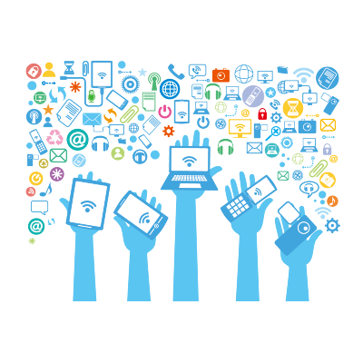

# 1️⃣ Economía Lineal y Economía Circular

{align="right"}

Vivimos en una sociedad que consume más recursos de los que el planeta puede regenerar. Desde la Revolución Industrial, el modelo productivo dominante ha sido la Economía Lineal, que se basa en una idea muy simple: extraer recursos, fabricar productos, consumirlos y tirarlos.

Este modelo funcionó durante décadas porque los recursos parecían infinitos y los efectos de la contaminación apenas se tenían en cuenta. Sin embargo, hoy sabemos que este sistema no es sostenible: genera toneladas de residuos, provoca emisiones que agravan el cambio climático y agota materias primas esenciales.

Frente a esta situación surge un nuevo modelo: la Economía Circular, que propone imitar a la naturaleza. En los ecosistemas naturales nada se desperdicia: los restos de un ser vivo sirven de nutrientes para otro. La EC busca aplicar esa lógica a la economía, cerrando los ciclos de producción para aprovechar al máximo los recursos, reducir residuos y cuidar el medio ambiente.

## La Economía Lineal (EL) se suele resumir con tres verbos: extraer → producir → desechar.

🔹 Características principales:

- Uso intensivo de materias primas: se extraen recursos de la naturaleza sin tener en cuenta su finitud.
- Consumo acelerado: los productos se diseñan para durar poco y así generar más ventas (obsolescencia programada o percibida).
- Generación de residuos: lo que ya no sirve, se tira.

🔹 Ejemplos en la vida diaria:

    - La moda rápida (fast fashion): camisetas que se fabrican en masa, se usan un par de veces y acaban en un vertedero.
    
    - Los móviles: cada año aparecen nuevos modelos, y los antiguos dejan de recibir actualizaciones o se rompen fácilmente.
    
    - El plástico de un solo uso: botellas, cubiertos o envases que usamos unos minutos y tardan siglos en descomponerse.

!!!bug "Problema principal"
    el modelo lineal no piensa en el “después”. El residuo simplemente se convierte en basura y el ciclo vuelve a empezar desde la extracción.

## La Economía Circular (EC)

La Economía Circular plantea un cambio radical: transformar el ciclo lineal en un ciclo cerrado. Aquí los recursos no se desechan, sino que se reutilizan, reciclan o regeneran.

🔹 Etapas clave:

- Diseño ecológico: productos pensados para durar, repararse o desmontarse fácilmente.
- Producción eficiente: menos gasto de energía y materiales, uso de energías renovables.
- Consumo responsable: alquilar en lugar de comprar, compartir, reparar en vez de tirar.
- Reutilización y reparación: alargar la vida útil de los productos.
- Reciclaje y recuperación: convertir residuos en materias primas para nuevos productos.

🔹 Ejemplos reales:

    - Empresas de informática que reciclan componentes de ordenadores para fabricar nuevos equipos.
    
    - Marcas de ropa que recogen prendas usadas para convertirlas en fibras textiles de nuevo.
    
    - El caso de las botellas retornables: se devuelven, se limpian y se reutilizan.

!!!tip "Ventajas"
    ♻️ Menos residuos en vertederos.

    🌬️ Menos contaminación en aire, agua y suelo.

    🪨 Menos dependencia de materias primas escasas.

    👩‍👧‍👦 Cumplimiento de los ODS (Objetivos de Desarrollo Sostenible) de la ONU, especialmente el 12 (producción y consumo responsables).

## Comparativa entre ambas economías

| Aspecto               | Economía Lineal (EL)                | Economía Circular (EC)                   |
| --------------------- | ----------------------------------- | ---------------------------------------- |
| **Uso de recursos**   | Explotación intensiva y agotamiento | Uso eficiente, reutilización y reciclaje |
| **Residuos**          | Elevados, sin tratamiento           | Mínimos, se convierten en recursos       |
| **Impacto ambiental** | Alto (contaminación, CO₂)           | Bajo (reducción de emisiones y residuos) |
| **Innovación**        | Escasa, modelo repetitivo           | Alta: diseño ecológico, nuevos negocios  |
| **Ejemplo típico**    | Plásticos de un solo uso            | Botellas retornables, reparación de PCs  |

👉 La Economía Circular (EC) no solo es "reciclar". Es **rediseñar** todo el sistema para que nada se desperdicie.

## Aplicación al sector productivo

Cada ciclo formativo puede encontrar ejemplos de cómo aplicar la Economía Circular. Veamos los diferentes casos con ejemplos prácticas del día a día.

🔹**Informática y comunicaciones**

    Reutilización de ordenadores antiguos con software ligero.

    Reciclaje de componentes electrónicos.

    Uso de servicios en la nube en lugar de hardware físico innecesario.

🔹**Automoción**

    Vehículos eléctricos y baterías reciclables.

    Piezas fabricadas con impresión 3D a partir de materiales reciclados.

🔹**Sanidad**

    Reducción de plásticos desechables.

    Reutilización segura de equipos médicos esterilizables.

🔹**Hostelería y turismo**

    Eliminación de pajitas y envases de plástico.

    Aprovechamiento de excedentes alimentarios.

## Conclusión

La Economía Lineal nos ha llevado al desarrollo industrial y al consumo masivo, pero ha mostrado sus límites. La Economía Circular, en cambio, propone un modelo más inteligente y respetuoso con el planeta.

Entender la diferencia entre ambos modelos no es solo teoría: es la base para que, como futuros profesionales, podamos trabajar en empresas más sostenibles y competitivas.

---

## 😿 Actividades

1. **Debate inicial**: ¿Qué producto de tu vida diaria representa mejor la Economía Lineal? ¿Qué producto conoces que siga la Economía Circular?

2. **Ejercicio de investigación**: Busca una empresa de tu sector que aplique principios de Economía Circular. Explica qué hace y qué beneficios obtiene.

3. **Actividad práctica**: Crea un cartel o infografía en grupo donde se muestre un proceso lineal y cómo podría transformarse en circular.