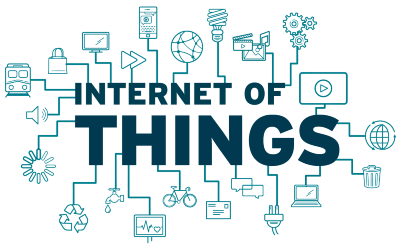

# 4️⃣ Tecnologías Habilitadoras Digitales (THD)

{align="right"}

Vivimos en una era en la que la tecnología no solo acompaña a la producción, sino que **la redefine por completo**.
La **Cuarta Revolución Industrial**, también llamada *Industria 4.0*, no existiría sin las **Tecnologías Habilitadoras Digitales (THD)**.

Estas tecnologías son las **herramientas clave** que permiten a las empresas ser más rápidas, eficientes, sostenibles y competitivas. Están transformando todos los sectores: desde la automoción hasta la sanidad, pasando por el comercio, la educación y la agricultura.

En este tema aprenderás qué son, cómo funcionan y por qué están revolucionando el mundo.

## 2. ¿Qué son las Tecnologías Habilitadoras Digitales (THD)?

Las **THD** son el conjunto de tecnologías que **permiten la digitalización de los procesos productivos y de servicios**.
Son las que hacen posible el salto del modelo clásico al modelo digital, automatizado y conectado.

En otras palabras:

> Son las “piezas” que permiten construir la Industria 4.0.

### Ejemplo:

Piensa en una fábrica de coches:

* Los **sensores** detectan errores en una pieza (IoT).
* Una **inteligencia artificial** analiza los datos y predice una avería.
* Un **robot colaborativo** sustituye la pieza.
* Todo se registra en la **nube** y se optimiza con **Big Data**.
  Esa integración tecnológica es lo que define a una empresa 4.0.

---

## 3. Principales Tecnologías Habilitadoras Digitales

### 🛰️ 3.1. Internet de las Cosas (IoT)

El **Internet of Things (IoT)** conecta objetos físicos (máquinas, vehículos, sensores, electrodomésticos) a Internet, permitiendo que **envíen y reciban datos**.

➡️ *Ejemplo:* un frigorífico inteligente que avisa cuando falta leche o una máquina que informa automáticamente de un fallo.

**Ventajas:**

* Control remoto de dispositivos.
* Ahorro de recursos.
* Mantenimiento predictivo.
* Mayor seguridad y trazabilidad.

---

### 🧠 3.2. Inteligencia Artificial (IA)

La **IA** permite que las máquinas aprendan de los datos y tomen decisiones por sí mismas.
Se utiliza en múltiples ámbitos: desde los asistentes virtuales hasta el análisis de grandes volúmenes de información.

➡️ *Ejemplo:* algoritmos que recomiendan productos en Amazon o detectan fraudes bancarios.

**Ventajas:**

* Automatiza tareas repetitivas.
* Aumenta la precisión.
* Mejora la personalización de servicios.

---

### 📊 3.3. Big Data

El término **Big Data** se refiere al manejo de **grandes volúmenes de datos** que las empresas generan constantemente.
Estos datos, bien analizados, ofrecen información valiosa para tomar decisiones estratégicas.

➡️ *Ejemplo:* Netflix analiza los gustos de millones de usuarios para decidir qué series producir.

**Ventajas:**

* Predicción de tendencias.
* Optimización de recursos.
* Personalización del producto o servicio.

---

### 📶 3.4. Tecnología 5G

El **5G** es la quinta generación de redes móviles.
Su velocidad y baja latencia permiten conectar **millones de dispositivos al mismo tiempo**, algo esencial para el IoT y la automatización.

➡️ *Ejemplo:* coches autónomos comunicándose entre sí o cirugías a distancia.

**Ventajas:**

* Mayor velocidad de transmisión.
* Menor tiempo de respuesta.
* Más estabilidad en conexiones simultáneas.

---

### 🤖 3.5. Robótica colaborativa (Cobots)

Los **cobots** son robots diseñados para **trabajar junto a las personas**, compartiendo espacio y tareas.
A diferencia de los robots industriales tradicionales, son seguros, adaptables y fáciles de programar.

➡️ *Ejemplo:* un cobot que ayuda a un operario a levantar piezas pesadas o a montar componentes electrónicos.

**Ventajas:**

* Aumenta la productividad.
* Reduce riesgos laborales.
* Mejora la calidad del producto.

---

### 🔗 3.6. Blockchain

El **Blockchain** o *cadena de bloques* es una tecnología que **garantiza la seguridad y trazabilidad de la información**.
Es la base de las criptomonedas, pero también se usa en contratos digitales, trazabilidad alimentaria o gestión de identidades.

➡️ *Ejemplo:* seguimiento de un producto desde su fabricación hasta la venta final.

**Ventajas:**

* Transparencia.
* Seguridad en transacciones.
* Imposibilidad de alterar los registros.

---

### 🛡️ 3.7. Ciberseguridad

La **ciberseguridad** es esencial para proteger los sistemas conectados frente a ataques o pérdidas de información.
Incluye el uso de contraseñas seguras, cortafuegos, antivirus, copias de seguridad y protocolos de encriptación.

➡️ *Ejemplo:* sistemas bancarios que detectan accesos sospechosos o redes corporativas protegidas con VPN.

**Ventajas:**

* Protege la información sensible.
* Evita pérdidas económicas.
* Aumenta la confianza digital.

---

### 🧱 3.8. Fabricación aditiva (Impresión 3D)

La **fabricación aditiva** consiste en **crear objetos capa a capa** a partir de modelos digitales.
Es muy utilizada en la industria, la medicina o la educación.

➡️ *Ejemplo:* prótesis médicas personalizadas o piezas de automóviles.

**Ventajas:**

* Personalización total.
* Reducción de residuos.
* Producción más rápida y económica.

---

### 🕶️ 3.9. Realidad virtual (VR) y gemelos digitales

La **realidad virtual (VR)** permite simular entornos o situaciones reales mediante gafas o dispositivos inmersivos.
Los **gemelos digitales** son **copias virtuales de objetos reales** que permiten simular su funcionamiento antes de construirlos.

➡️ *Ejemplo:* simuladores de vuelo o pruebas virtuales de maquinaria industrial.

**Ventajas:**

* Formación segura y económica.
* Mejora en el diseño de productos.
* Predicción de errores antes de fabricar.

---

## 4. Ventajas de incorporar las THD en el sistema productivo

* 💡 **Productividad:** las empresas producen más en menos tiempo.
* 🔁 **Eficiencia:** se reducen costes y desperdicios.
* 🌱 **Sostenibilidad:** se optimiza el consumo de energía y materiales.
* 👥 **Mejor experiencia del cliente:** productos más personalizados.
* 🧭 **Toma de decisiones inteligentes:** gracias a los datos y la IA.
* 🔒 **Seguridad:** tanto física como digital.

---

## 5. Ejemplos de aplicación real

| Sector      | Tecnología aplicada | Ejemplo                                          |
| ----------- | ------------------- | ------------------------------------------------ |
| Automoción  | IoT + IA            | Coches conectados que se actualizan por Internet |
| Agricultura | Big Data + IoT      | Sensores de humedad que optimizan el riego       |
| Sanidad     | IA + VR             | Diagnóstico asistido y formación médica          |
| Comercio    | Blockchain          | Seguimiento de productos y pagos seguros         |
| Educación   | Cloud + VR          | Aulas virtuales y simuladores de aprendizaje     |

---

## 🧩 Actividades del Tema 4

1. **Mapa tecnológico:**
   Crea un esquema donde relaciones las diferentes tecnologías habilitadoras con ejemplos de aplicación real.

2. **Investigación:**
   Busca una empresa de tu entorno (Alicante o Comunidad Valenciana) que haya incorporado alguna THD. Explica qué tecnología usa y qué beneficios obtiene.

3. **Debate en grupo:**
   ¿Sustituirán los robots a los humanos o trabajarán con ellos? Argumenta con ejemplos.

4. **Juego de clasificación:**
   El docente proyecta ejemplos reales (Netflix, Tesla, Amazon, Glovo, etc.) y los alumnos deben identificar qué tecnologías usan.

5. **Práctica digital:**
   Realiza una búsqueda guiada en la web sobre “gemelos digitales” o “fabricación aditiva” y presenta un ejemplo con imágenes.

---