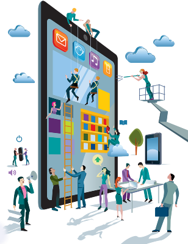

# Bienvenid@s a Digitalización

{align="right"}

La transformación digital está cambiando la forma en que vivimos, trabajamos y producimos. Las empresas ya no funcionan únicamente con procesos manuales y lineales, sino que incorporan tecnologías avanzadas que permiten optimizar recursos, mejorar la sostenibilidad y adaptarse a un mundo cada vez más conectado.

El módulo de Digitalización busca que el alumnado adquiera una visión global de esta transformación y sepa identificar cómo afecta al sector en el que van a desarrollar su profesión. Se trata de una asignatura transversal, útil para cualquier ciclo de FP, que conecta los conceptos de economía, sostenibilidad y tecnología.

## 🎯 Resultados de Aprendizaje (RA)

- Economía Lineal y Circular → Diferenciar ambos modelos y valorar la EC como motor de sostenibilidad.
- Cuarta Revolución Industrial → Identificar los cambios de la Industria 4.0 y sus ventajas para empresas y clientes.
- Cloud y sistemas conectados → Conocer la estructura, tipología y aplicaciones de la nube y el edge/fog/mist computing.
- Sistemas de producción digitalizados → Comparar los sistemas clásicos con los digitalizados y conocer tecnologías habilitadoras (IA, IoT, Big Data, etc.).
- Planes de transformación digital → Ser capaz de diseñar un plan de transformación de una empresa clásica hacia un modelo digitalizado y sostenible.

## 📝 Sistema de Evaluación

- Pruebas escritas y/o orales sobre conceptos teóricos → 40%
- Actividades prácticas, análisis de casos y trabajos individuales → 30%
- Proyecto o trabajo en grupo aplicado al sector del ciclo → 20%
- Actitud, participación y uso responsable de herramientas digitales → 10%

!!!warning "Criterios de calificación"
  - Se debe alcanzar al menos un 5 sobre 10 en el conjunto.
  - Es obligatorio realizar y entregar las prácticas y proyectos.
  - Se valorará especialmente la aplicación práctica de los conceptos a situaciones reales del sector.